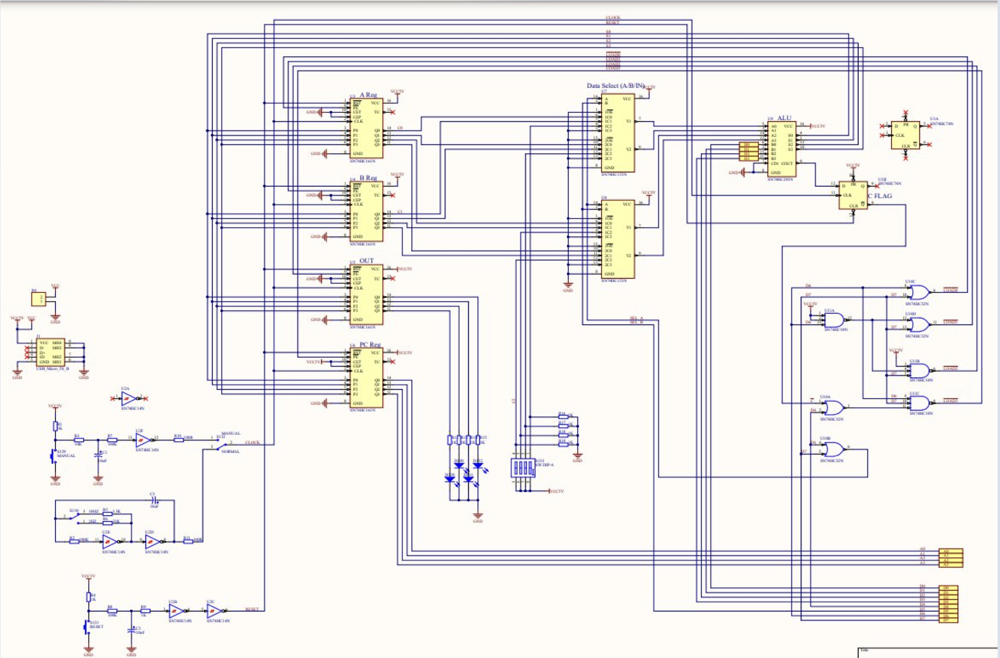
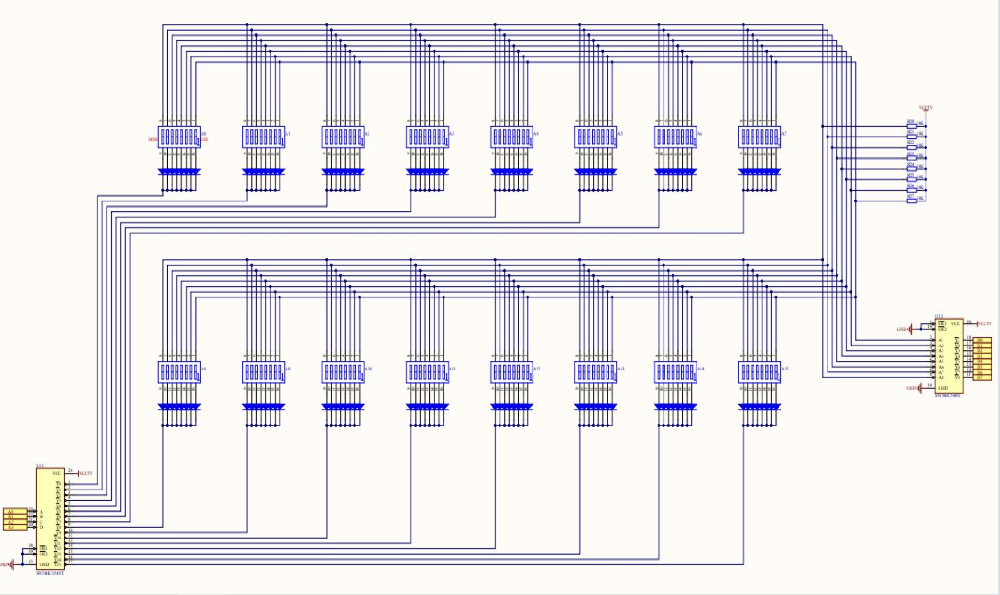

## TD4 emulator

Here I present you written by my own TD4 processor emulator. 
You can load into it's ROM your instructions in hex format, then TD4  will execute them. 

Line of code that is executed rigth now will be highlited by red. When processor will need an input, input space will be highlited by green.

### Some programs for TD4:
|  |  |
|----------------------------------|----------------|
| 20000fe75ff2005f90f0000000000000 | reverse bits   |
| 20600fef51f200000000000000000090 | sum of A and B |
| 33054f9ff00000000000000000000000 | 8 to 6         |

### Principle scheme of TD4

### Offisial opcode

| | |
|---------|------|
|ADD A,Im | 0000 |
|ADD B,Im | 0101 |
|MOV A,Im | 0011 |
|MOV B,Im | 0111 |
|MOV A,B  | 0001 |
|MOV B,A  | 0100 |
|JMP Im   | 1111 |
|JNC Im   | 1110 |
|IN A     | 0010 |
|IN B     | 0110 |
|OUT B    | 1001 |
|OUT IM   | 1011 |

### Unoffisial opcode 
1000 - add a number to B register, write into OUT.\
1010 - add a number to ZERO, write into OUT.\
1100 - add a number to B register, write into PC if there is no CF.\
1101 - add a number to B register, write into PC.
